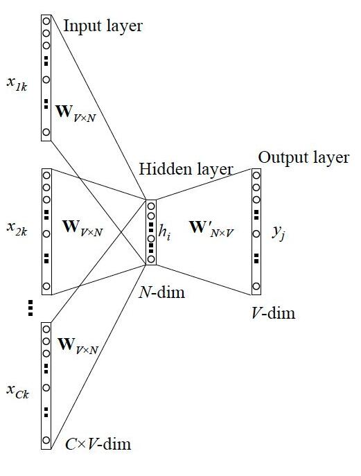

## Wordvec相关整理

以下都是个人整理总结，如果有错，欢迎指正

### 原理部分：

#### 1.相关资料整理

* 数学基础：https://www.cnblogs.com/peghoty/p/3857839.html
* 补充内容：
  * https://zhuanlan.zhihu.com/p/26306795
  * https://www.zhihu.com/question/44832436
  * https://blog.csdn.net/lilong117194/article/details/81979522
  * https://www.zybuluo.com/Dounm/note/591752
  * https://blog.csdn.net/liujian20150808/article/details/105215414 (很多问题总结)
* 层次softmax相关：
  * https://www.cnblogs.com/eniac1946/p/8818892.html
  * https://blog.csdn.net/weixin_48185819/article/details/106405090
  * https://my.oschina.net/u/4340062/blog/4282738/print
* 负采样相关：
  * https://www.jianshu.com/p/7a206dee2ab5
* 代码参考：
  * 动⼿学深度学习 PYTORCH 版(DEMO)
* 上传的pdf:
  * Efficient_Estimation_of_Word_Representations_in_Ve.pdf (word2vec原论文)
  * cs224 笔记

#### 2.word2vec 简单介绍

word2vec分成两种类型：skip-gram与CBOW

----------------------------------------------

skip-gram: 通过中心词来预测前后窗口中的背景词

我们需要的词向量也就是网络中的参数：W

------------------------------------------

CBOW: 通过前后窗口中的背景词来预测中心词，与skip-gram模型相对

我们需要的词向量也就是网络中的参数：W

#### 3.word2vec 实现过程中的疑惑与解答

3.1 是否需要one-hot作为输入

答：这个问题的出现是因为我发现很多文章在介绍word2vec的过程中省略了 one-hot到词向量的过程，导致我有点怀疑是否需要。答案是肯定的，正如我上面的图示，需要one-hot借助W，变成对应单词的词向量。

​       这里有一个比较有意思的点：one-hot只有一维为1，也就是得到的隐藏层就是取了W的一行，最后训练好后，W的每一行都对应一个词的词向量，所以W就是我们需要的词向量。

3.2 常说的背景词向量和中心词向量是什么

答：除了W，我们其实还训练了W‘，所以是两份词向量，但我们实际使用的只有W一个；在背景词这边的就是背景词向量，在中心词这边的就是中心词向量。注意计算的公式，也是两个词向量中不同行之间的乘积.
$$
y_i=u_i^{T}* v_c
$$
3.3 近似训练方法感觉不像是训练神经网络

答：其实原先的设计就和nnlp差不多，只是不是要取窗口，最后也是用softmax计算概率和用交叉熵计算损失，然后训练，但是这样一来计算量太大，因此就产生了近似训练：

负采样方法：优化目标修改，类似神经网路，但本质不是

层次softmax：将映射层到输出层的网络改成了霍夫曼树

#### 4.word2vec 实现过程中一些注意

4.1 通用注意事项：

* 参考动⼿学深度学习 PYTORCH 版(DEMO)，最好建立词语索引，方便后续操作

* 需要进行二次采样，减少高频词的出现频率，使得后续窗口更有价值，丢弃概率公式：
  $$
  P(w_i)=max(1-\sqrt{t/f(w_i)})
  $$

* 实际在取窗口的时候，由于长度不一定够，所以随机取[1, window_size]个，并根据实际长度调整

4.2 负采样注意：

* 根据word2vec论⽂的建议，噪声词采样权重设为当前词频与总词频之⽐的0.75次⽅

4.3 层次softmax

* 注意左孩子编码1，右孩子0

#### 5.word2vec 代码

* 负采样的代码是参考了动⼿学深度学习 PYTORCH 版(DEMO)
* 层次softmax的代码是自己凭感觉写的，可能很冗余，并且实现不如源码，甚至可能有错，欢迎各位给出出建议
* code文件夹中是代码，DataProcess.py负责数据处理，Dataset是将处理好的数据整理成可以遍历读取的数据集

-------------------

初版 2020.8.19 后续回来优化，以及补充其他词向量

